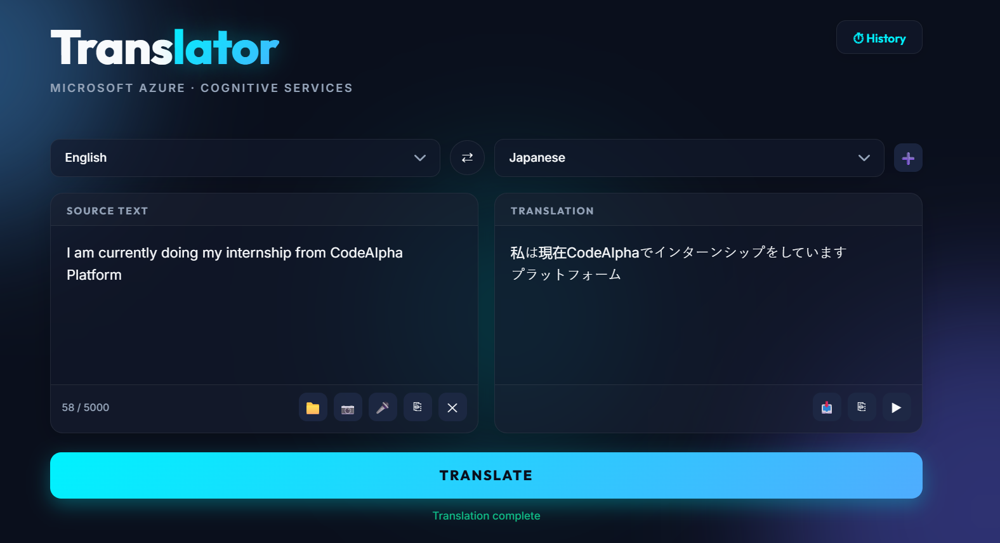
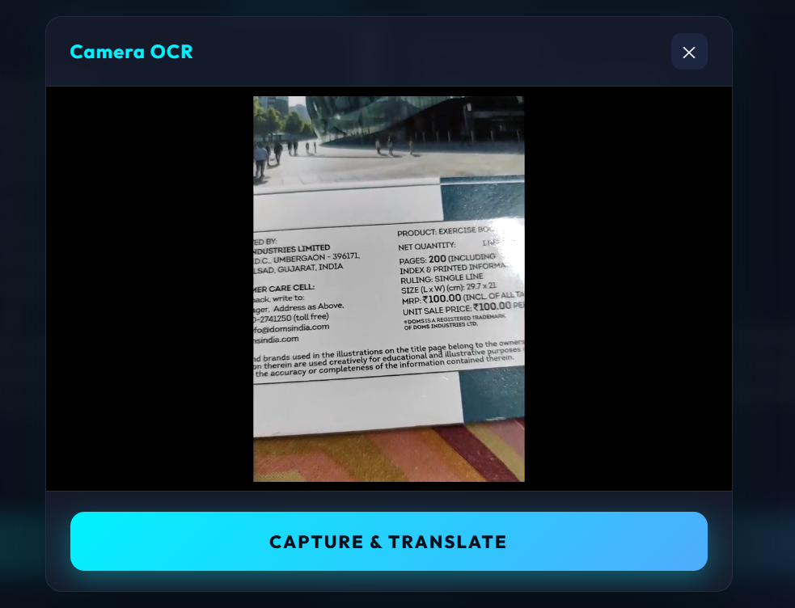

# 🌐 CodeAlpha AI-Integrated Language Translator


A professional-grade, full-stack language translation and OCR tool that bridges a stunning "Midnight Glassmorphism" frontend with the power of **Microsoft Azure Cognitive Services API**. This project demonstrates secure API integration, asynchronous event handling, real-time webcam data processing, and premium modern UI/UX principles.

---

## 📸 Preview


---



---

## ✨ Key Features

* **Real-Time Translation:** Powered by the **Azure Translator V3 API**, supporting over 70+ languages.
* **Live Camera OCR Translation:** Access your device's webcam to instantly snap a photo, extract the text using **Azure Vision API**, and seamlessly translate it over a live video overlay.
* **Upload Image OCR:** Upload any image from your computer to automatically extract and translate the text within it.
* **Multi-Branch "Compare" UI:** A power-user feature leveraging `Promise.all` to simultaneously translate a single source text into **two different target languages** at once.
* **Translation History:** Automatically persists your last 10 translations in browser `localStorage`, accessible via a sleek slide-out sidebar.
* **Speech & Audio:** Integrated **Web Speech API** for hands-free STT (Speech-to-Text) voice input, and TTS (Text-to-Speech) auditory feedback with native-sounding accents.
* **Smart Copy & Download:** Easily download translations as `.txt` files or use the "Smart Copy" feature to copy text with a professional branded footer.
* **Premium UI/UX:** A visually striking "Midnight Glassmorphism" aesthetic featuring animated background orbs, smooth hover micro-animations, and dynamic visual language detection badges.

---

## 🛠️ Tech Stack
* **Frontend:** HTML5, CSS3 (Glassmorphism, Flexbox, CSS Grid), Vanilla JavaScript.
* **Backend:** Node.js, Express.js.
* **APIs:** 
  * Microsoft Azure Cognitive Services (Translator API)
  * Microsoft Azure AI Vision (OCR API)
* **Security:** `dotenv` for environment variable management and credential masking.

---

## 🏗️ Architecture & Security
To ensure industry-standard security, this project utilizes a **Backend Proxy** architecture. Instead of calling Azure directly from the browser (which would expose private API keys), the frontend communicates with a local Node.js server. 

* **CORS Protection:** Configured via Express middleware to allow only authorized requests.
* **Large Payload Handling:** Configured `express.json({ limit: '10mb' })` to safely parse large Base64 image strings from the camera and file uploads.
* **Credential Masking:** API keys are strictly stored in a `.env` file, which is excluded from version control via `.gitignore`.
* **Separation of Concerns:** Distinct CSS, Frontend JS, and Backend JS files for better maintainability.

---

## 🚀 Installation & Setup

1. **Clone the Repository:**
   ```bash
   git clone https://github.com/DevBySuraj/CodeAlpha_Language_Translation_Tool.git
   cd CodeAlpha_Language_Translation_Tool
   ```

2. **Install Dependencies:**
   ```bash
   npm init -y
   npm install express axios cors dotenv
   ```

3. **Environment Setup:**
   Create a `.env` file in the root directory and add your Azure credentials. You will need keys for both Translator and Vision APIs.
   ```env
   # Translation Credentials
   AZURE_KEY=your_translator_secret_key_here
   AZURE_REGION=your_approved_region
   ENDPOINT=https://api.cognitive.microsofttranslator.com

   # Computer Vision OCR Credentials
   VISION_KEY=your_vision_secret_key_here
   VISION_ENDPOINT=https://your_region.api.cognitive.microsoft.com/
   ```

4. **Run the Application:**
   * Start the server: 
     ```bash
     node server.js
     ```
   * Open `index.html` in your favorite modern browser (recommend using VSCode Live Server or a standard HTTP server for camera permissions).

---

## 📜 Development Logic
* **Why No React?** I opted for Vanilla JavaScript to maintain a zero-dependency frontend, demonstrating strong fundamentals in DOM manipulation, asynchronous programming, and core Web APIs like `getUserMedia` and `SpeechRecognition`.
* **Security Choice:** Implementing a Node.js backend proxy was a deliberate choice to prevent API key scraping and securely handle CORS for complex multi-API orchestrated requests.

---

## 👨‍💻 Author
**[DevBySuraj]** 
*Computer Science Student, Chandigarh University 2028* 
[LinkedIn](https://www.linkedin.com/in/suraj8144/) | [GitHub](https://github.com/DevBySuraj)
