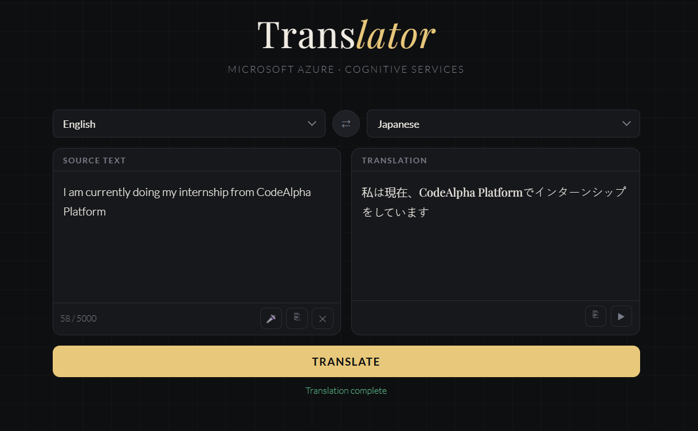

# CodeAlpha_Language_Translation_Tool
language translation tool where user can enter text and select source and target language to translate the entered text


# 🌐 AI-Integrated Language Translator 
### *Microsoft Azure · Node.js · Full-Stack Web Application*

A professional-grade language translation tool that bridges a sleek, minimalist frontend with the **Microsoft Azure Cognitive Services API**. This project demonstrates secure API integration, asynchronous event handling, and modern UI/UX principles.

---

## 📸 Preview


---

## ✨ Key Features
* **Real-Time Translation:** Powered by **Azure Translator V3 API**, supporting over 70+ languages.
* **Speech-to-Text (STT):** Integrated **Web Speech API** for hands-free voice input.
* **Text-to-Speech (TTS):** Auditory feedback for translated text with native-sounding accents.
* **Secure Backend:** Built with **Node.js/Express** to manage API credentials safely via environment variables.
* **Smart UI:** Minimalist, monochromatic design with dark-mode support and character counting.
* **One-Click Utilities:** Copy-to-clipboard functionality for both source and translated text with visual feedback.

---

## 🛠️ Tech Stack
* **Frontend:** HTML5, CSS3 (Custom Grid & Flexbox), Vanilla JavaScript.
* **Backend:** Node.js, Express.js.
* **API:** Microsoft Azure Cognitive Services (Translator).
* **Security:** `dotenv` for environment variable management.

---

## 🏗️ Architecture & Security
To ensure industry-standard security, this project utilizes a **Backend Proxy** architecture. Instead of calling Azure directly from the browser (which would expose my private API key), the frontend communicates with a local Node.js server. 


* **CORS Protection:** Configured via Express middleware to allow only authorized requests.
* **Credential Masking:** API keys are strictly stored in a `.env` file, which is excluded from version control via `.gitignore`.
* **Separation of Concerns:** Distinct CSS, Frontend JS, and Backend JS files for better maintainability.

---

## 🚀 Installation & Setup

1.  **Clone the Repository:**
    ```bash
    git clone https://github.com/DevBySuraj/CodeAlpha_Language_Translation_Tool.git
    ```

    ----
    ```
    cd CodeAlpha_Language_Translation_Tool
    ```

2.  **Install Dependencies:**
    Initialize the Node
    ```bash
    npm init -y
    ```
    ----

    ```bash
    npm install express axios cors dotenv
    ```

3.  **Environment Setup:**
    Create a `.env` file in the root directory and add your Azure credentials:
    ```env
    AZURE_KEY=your_secret_key_here
    AZURE_REGION=your_approved_region
    ENDPOINT=[https://api.cognitive.microsofttranslator.com](https://api.cognitive.microsofttranslator.com)
    ```

4.  **Run the Application:**
    * Start the server: `node server.js`
    * Open `index.html` in your browser.

---

## 📜 Development Logic
* **Why No React?** I opted for Vanilla JavaScript to maintain a zero-dependency frontend, demonstrating strong fundamentals in DOM manipulation and core Web APIs.
* **Security Choice:** Implementing a Node.js backend proxy was a deliberate choice to prevent API key scraping and manage Cross-Origin Resource Sharing (CORS).

---

## 👨‍💻 Author
**[DevBySuraj]** *Computer Science Student, Chandigarh University 2028* [https://www.linkedin.com/in/suraj8144/] | [https://github.com/DevBySuraj]


